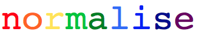

> A module for normalising text.

## Introduction

This module takes a text as input, and returns it in a normalised form, *ie.* expands all word tokens deemed not to be of a standard type. Non-standard words (NSWs) are detected, classified and expanded. Examples of NSWs that are normalised include:

* Numbers - percentages, dates, currency amounts, ranges, telephone numbers.
* Abbreviations and acronyms.
* Web addresses and hashtags.


## Table of Contents
1. [Installation](#installation)
2. [Usage](#usage)
  2. [Customise to your variety](#variety)
  2. [Input your own abbreviation dictionary](#abbrevs)
  2. [Execute normalise from the command line](#command)
3. [Example](#example)
4. [Authors](#authors)
5. [License](#license)
6. [Acknowledgements](#acknows)


## 1. <a name="installation"><a/>Installation

normalise requires Python 3.

To install the module (on Windows, Mac OS X, Linux, etc.) and to ensure that you have the latest version of pip and setuptools:

```
$ pip install --upgrade pip setuptools

$ pip install normalise
```

If `pip` installation fails, you can try `easy_install normalise`.

normalise has several nltk data dependencies. Install these by running the following python commands:

```python
import nltk
for dependency in ("brown", "names", "wordnet", "averaged_perceptron_tagger", "universal_tagset"):
    nltk.download(dependency)
```

## 2. <a name="usage"><a/>Usage

Your input text can be a list of words, or a string.

To normalise your text, use the `normalise` function. This will return the text with NSWs replaced by their expansions:

```python
text = ["On", "the", "28", "Apr.", "2010", ",", "Dr.", "Banks", "bought", "a", "chair", "for", "£35", "."]

normalise(text, verbose=True)

Out:
['On',
 'the',
 'twenty-eighth of',
 'April',
 'twenty ten',
 ',',
 'Doctor',
 'Banks',
 'bought',
 'a',
 'chair',
 'for',
 'thirty five pounds',
 '.']
```

`verbose=True` displays the stages of the normalisation process, so you can monitor its progress. To turn this off, use `verbose=False`.

If your input is a string, you can use our basic tokenizer. For best results, input your own custom tokenizer.

```python
from normalise import tokenize_basic
normalise(text, tokenizer=tokenize_basic, verbose=True)
```

In order to see a list of all NSWs in your text, along with their index, tags, and expansion, use the `list_NSWs` function:

```python
from normalise import list_NSWs
list_NSWs(text)

Out:
({3: ('Apr.', 'ALPHA', 'EXPN', 'April'),
  6: ('Dr.', 'ALPHA', 'EXPN', 'Doctor')},
 {2: ('28', 'NUMB', 'NORD', 'twenty-eighth of'),
  4: ('2010', 'NUMB', 'NYER', 'twenty ten'),
  12: ('£35', 'NUMB', 'MONEY', 'thirty five pounds')}
 ```

### i. <a name="variety"><a/>Customise to your variety

In order to customise normalisation to your variety of English, use `variety="BrE"` for British English, or `variety="AmE"` for American English:

```python
text = ["On", "10/04", ",", "he", "went", "to", "the", "seaside", "."]

normalise(text, variety="BrE")
Out: ['On', 'the tenth of April', ',', 'he', 'went', 'to', 'the', 'seaside', '.']

normalise(text, variety="AmE")
Out: ['On', 'the fourth of October', ',', 'he', 'went', 'to', 'the', 'seaside', '.']
```

If a variety is not specified, our default is British English.

### ii. <a name="abbrevs"><a/>Input your own abbreviation dictionary

Although our system aims to be domain-general, users can input their own dictionary of abbreviations in order to tailor to a specific domain. This can be done using the keyword argument `user_abbrevs={}`:

```python
my_abbreviations = {"bdrm": "bedroom",
                    "KT": "kitchen",
                    "wndw": "window",
                    "ONO": "or near offer"}

text = ["4bdrm", "house", "for", "sale", ",", "£459k", "ONO"]

normalise(text, user_abbrevs=my_abbreviations)

Out:
['four bedroom',
 'house',
 'for',
 'sale',
 ',',
 'four hundred and fifty nine thousand pounds',
 'or near offer']
 ```

### iii. <a name="command"><a/>Execute normalise from the command line

From the command line, you can normalise text from a given .txt file. Use the command `normalise /path/to/your-file.txt`. This will print the normalised output, as well as save it to a separate file "your-file_normalised.txt" in the same directory as the original text.

To specify the variety as American English, use `--AmE` (default is British English). For a verbose output, use `--V`:

```
$ normalise /path/to/your_file.txt --AmE --V
```

## 3. <a name="example"><a/>Example

A further example demonstrating the expansion of more types of NSW (including abbreviations, spelling mistakes, percentage ranges, currency):

```python
text = ["On", "the", "13", "Feb.", "2007", ",", "Theresa", "May", "MP", "announced",
"on", "ITV", "News", "that", "the", "rate", "of", "childhod", "obesity", "had", "risen",
"from", "7.3-9.6%", "in", "just", "3", "years", ",", "costing", "the", "Gov.", "£20m", "."]

normalise(text, verbose=True)

Out:
['On',
 'the',
 'thirteenth of',
 'February',
 'two thousand and seven',
 'Theresa',
 'May',
 'M P',
 'announced',
 'on',
 'I T V',
 'News',
 'that',
 'the',
 'rate',
 'of',
 'childhood',
 'obesity',
 'had',
 'risen',
 'from',
 'seven point three to nine point six percent',
 'in',
 'just',
 'three',
 'years',
 ',',
 'costing',
 'the',
 'government',
 'twenty million pounds',
 '.']
 ```

## 4. <a name="authors"><a/>Authors

* **Elliot Ford** - [EFord36](https://github.com/EFord36)
* **Emma Flint** - [emmaflint27](https://github.com/emmaflint27)

Our system is described in detail in Emma Flint, Elliot Ford, Olivia Thomas, Andrew Caines & Paula Buttery (2016) - A Text Normalisation System for Non-Standard Words.

## 5. <a name="license"><a/>License

This project is licensed under the terms of the GNU General Public License version 3.0 or later.

Please see [LICENSE.txt](https://github.com/EFord36/normalise/blob/master/LICENSE.txt) for more information.

## 6. <a name="acknows"><a/>Acknowledgements

This project builds on the work described in [Sproat et al (2001)](http://www.cs.toronto.edu/~gpenn/csc2518/sproatetal01.pdf).

We would like to thank Andrew Caines and Paula Buttery for supervising us during this project.

The font used for the logo was Anita Semi-Square by Gustavo Paz.
License: [Attribution-ShareAlike 4.0 International (CC BY-SA 4.0)](http://creativecommons.org/licenses/by-sa/4.0/deed.en_US)
